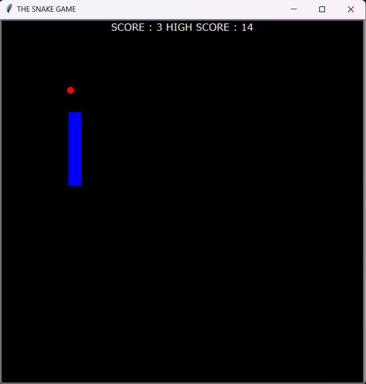
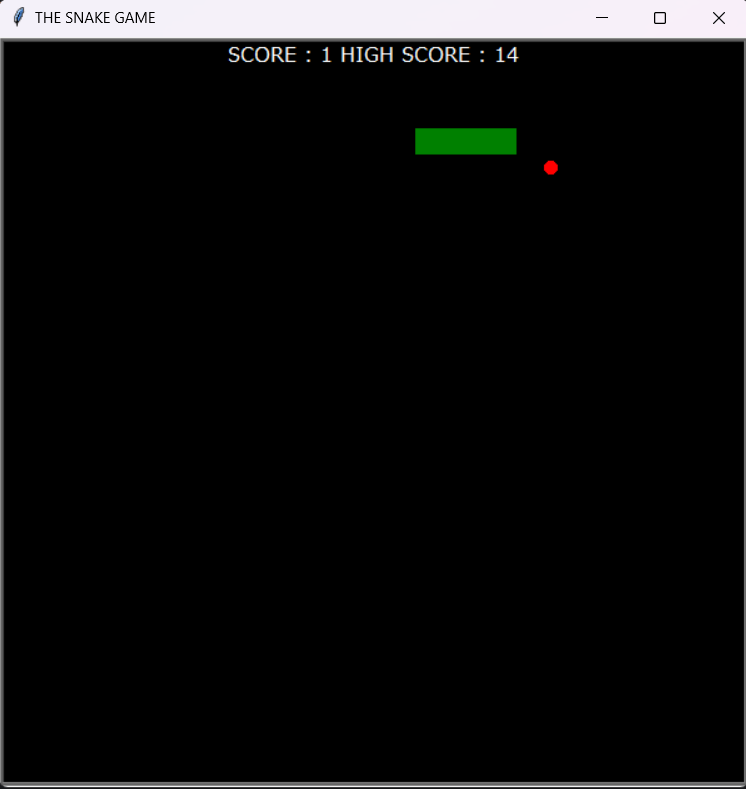

# Snake Game

This Snake Game project, implemented in Python using the Turtle module, offers a classic arcade gaming experience where players control a snake, aim to eat food to grow, and avoid collisions to achieve the highest score.

## Project Overview

The game consists of various components:

- **Snake Class:** Manages snake movement, growth, color changes, and game resetting.
- **Food Class:** Represents food pellets appearing randomly on the screen.
- **ScoreBoard Class:** Tracks and displays the player's score and highest achieved score.
- **Main Script:** Controls the game's logic, user inputs, collision detection, and game flow.

## Features

- Control the snake's direction using arrow keys (up, down, left, right).
- Snake grows longer upon eating food, increasing the player's score.
- Game ends upon collision with walls or with itself.
- Highest score achieved is stored and updated in `data.txt`.
- Two screenshots provided in the `/img` folder showcase gameplay and game over screens.

## Usage

1. Ensure Python and the Turtle module are installed.
2. Clone this repository.
3. Run the `main.py` file to start the game.

## Future Enhancements

- Implement levels of difficulty with varying speeds or game mechanics.
- Add power-ups, obstacles, or multiplayer functionalities.
- Enhance UI/UX with additional graphics or sound effects.

Feel free to contribute, report issues, or suggest improvements!

## Credits

- Screenshots captured from the game.
- Developed by [APTUUU](https://github.com/APTUUU).

